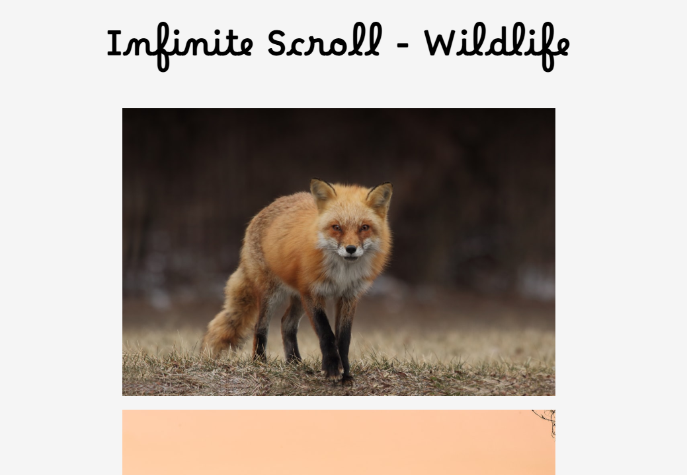

# Infinite Scroll

# DESCRIPTION
> Infinite scrolling of wildlife photos. Fetching wildlife photos from [Unsplash](https://unsplash.com/). Using the API I am fetching free wildlife photos. In doing this I have added a caption when hovering over the image to give the alt text from the API. It also allows the user to click on the photo to be redirected in a new tab to the actual photo with user name, if they have a personal site, and the equipments used. Allowing for download if the user desires.
> Within the script tag I have created for functions so the code is demonstrated as DRY.

# TECH
> - JavaScript
> - minimal HTML
> - CSS
> - Google Fonts
> - Unsplash API

# DESIGN
> Basic to a fault. Just shows the images scrolling along the page. It is responsive for mobile and tablets. I was just locking in the JavaScript side of using windows. for infinite scrolling, while fetching from and API.

# FEATURES
> Truthfully, not a ton of features, except to show the alt text on hover allowing the user to click on the photo to go directly to the place the photo resides.

# Upgrade
> need to incorporate hiding my API. I am still working on how to fix this issue without a backend. My go to is .env but it is not processing and gets an error. Still figuring it out.

# AUTHOR
#  **Blue Byrd Development**
## *Karen Byrd* 2024
